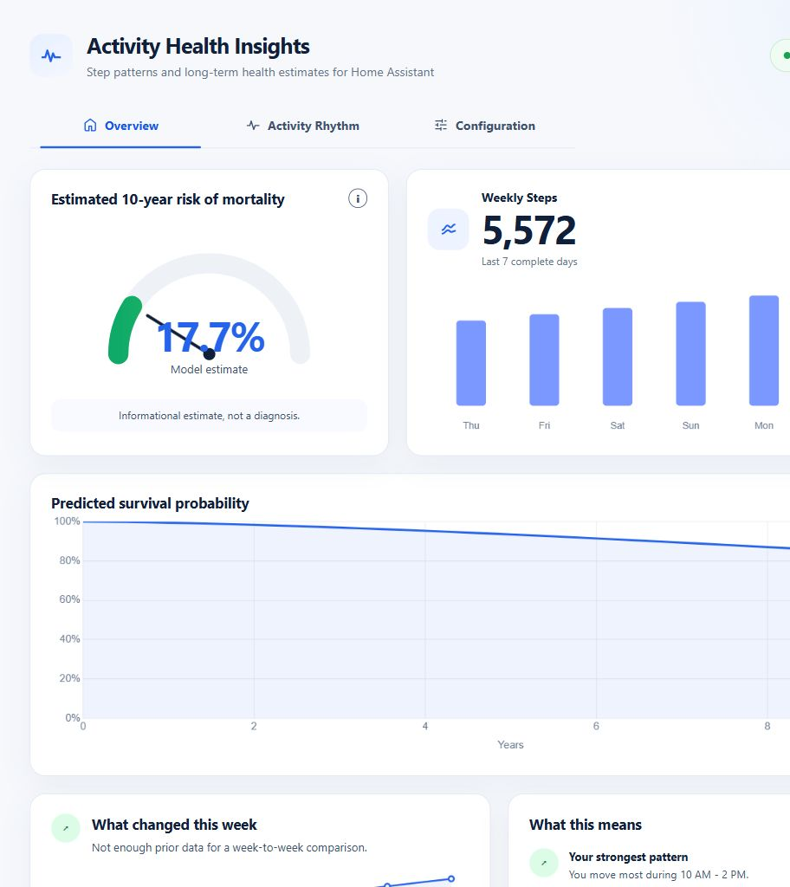

# Activity Health Insights Add-on

Step-pattern health estimates for Home Assistant.


[](https://my.home-assistant.io/redirect/supervisor_add_addon_repository/?repository_url=https%3A%2F%2Fgithub.com%2Fresace3%2FFPCA_AFT_Health_Addon)



---

## Overview

Activity Health Insights is an experimental Home Assistant add-on for:

- Functional data analysis
- Weekly activity modeling
- Survival prediction
- Longitudinal sensor analysis

The platform integrates Home Assistant sensor data with statistical modeling workflows.

---

## Features

- FPCA weekly activity scoring
- Long-term health estimate modeling
- Flask backend API
- Interactive frontend dashboard
- Home Assistant entity integration
- Remote-access compatible development workflow

## Dashboard

The Web UI has three focused views:

- **Overview** shows the model-based 10-year mortality-risk estimate, weekly steps,
  predicted survival curve, and conservative activity summaries.
- **Activity Rhythm** shows average activity by local clock hour, the most active
  four-hour window, and real comparison data when an earlier baseline is available.
- **Configuration** manages the activity entity, timezone, demographics, and health
  history used by the existing model.

Profile values are stored in the add-on's persistent `/data/health_profile.json` file.
Saving the form refreshes the estimate without reloading the page or changing tabs.

Additional screenshots: [Activity Rhythm](docs/ui-activity-rhythm.png) and
[Configuration](docs/ui-configuration.png).

---

## Architecture

```text
Home Assistant Sensors
        ↓
Backend API
        ↓
FPCA + Survival Models
        ↓
Frontend Dashboard
        ↓
Health Insights
```

---

## Installation

Click the button above to open Home Assistant and add this add-on repository.

If the button does not open the repository dialog, add it manually:

In Home Assistant:

```text
Settings → Add-ons → Add-on Store → Repositories
```

Add:

```text
https://github.com/resace3/FPCA_AFT_Health_Addon
```

Then:
- Refresh the Add-on Store
- Install `Activity Health Insights`
- Start the add-on
- Open Web UI
